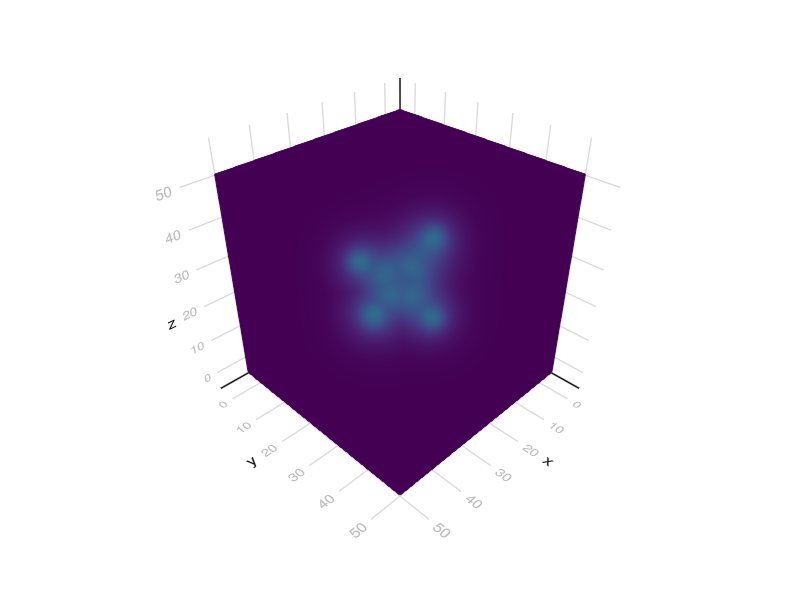
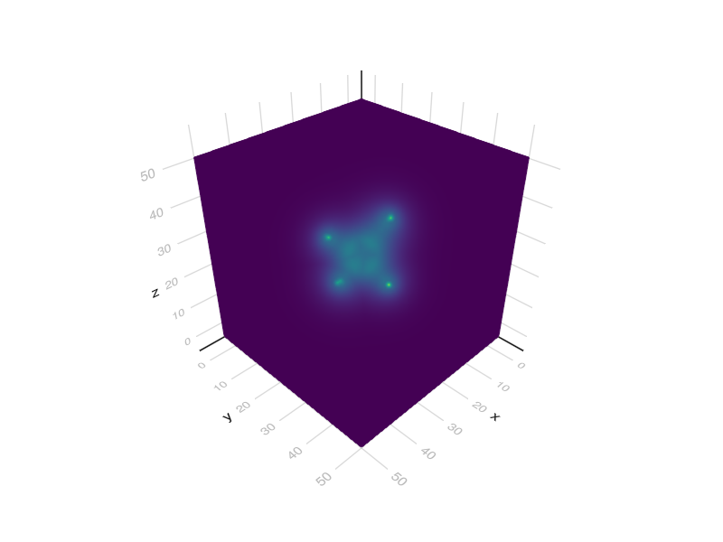

# Basics: predicting electron density and force fields

```julia
"""
we predict density and forces on equilibrium and distorted geometries of CH4
"""

using FileIO
using Random
using Statistics
using UnPack
Random.seed!(1)
using GLMakie: volume
using LinearAlgebra
using EquivariantOperators
include("../src/pretrained.jl")

# whether to re-instantiate models or load them from cache file
reset = true
# reset=false

# CH4 atomic numbers
Z = [6, 1, 1, 1, 1]

# positions in Bohr (1 Angstrom = 1.88973 Bohr)
pos0 = 1.88973 * [
    -0.0126981359 1.0858041578 0.0080009958
    0.002150416 -0.0060313176 0.0019761204
    1.0117308433 1.4637511618 0.0002765748
    -0.540815069 1.4475266138 -0.8766437152
    -0.5238136345 1.4379326443 0.9063972942]'
center!(pos0)

if !reset
    d = "."
    global predictor = load("$d\\demo2_predictor.jld2", "predictor")
else
    resolution = 0.15
    cell = resolution * I(3)
    d = "."
    # model = load("$d\\demo2.jld2", "model")
    model = DEMO2
    global predictor = DensityPredictor(cell, model,)
    d = "."
    save("$d\\demo2_predictor.jld2", "predictor", predictor)
end

# 8 x 8 x 8 Bohr box domain
domain = 8 * I(3)
origin = :center
periodic = false
mode = :verbose

# density prediction result
pos = pos0
res = predictor(Z, pos, domain; periodic, origin, mode)
@unpack ρ, grid = res
s = volume(ρ)
display(s)
# save("ch4.png",s)

# forces in Hartrees / Bohr
d = "."
if !reset
    calc = load("$d\\calc.jld2", "calc",)
else
    cell = 0.1I(3)
    calc = ForceField(cell)
    save("$d\\calc.jld2", "calc", calc)
end

forces = calc(Z, pos, ρ; origin, cell=predictor.cell)
@info "forces near equilibrium"
@info "CH length: $(norm(pos[:, 1] - pos[:, 2])) Bohr"
display(forces)

# compress geometry and recalculate forces
pos = 0.9pos0
@info "forces for compressed geometry"
@info "CH length: $(norm(pos[:, 1] - pos[:, 2])) Bohr"
ρ = predictor(Z, pos, domain; periodic, origin)
forces = calc(Z, pos, ρ; origin, cell=predictor.cell)
display(forces)

s = volume(ρ)
display(s)
# save("ch4c.png",s)

# geometry relaxation loop - needs to fix stability issues
# for i = 1:12
#     ρ = predictor(Z, pos, domain; periodic, origin)
#     forces .= calc(Z, pos, ρ; origin, cell=predictor.cell)
#     pos .+= .2forces
#     display(forces)
#     @show norm(pos[:, 1] - pos[:, 2])
# end
```

## Output



<!--  -->

```
[ Info: forces near equilibrium
[ Info: CH length: 2.0634964549624915 Bohr
3×5 Matrix{Float64}:
  0.000827607  -1.74149e-5   0.0176606   -0.00994492  -0.00902619
 -0.00785024   -0.0171859    0.00718738   0.00672194   0.0062683
  0.0017415    -4.89954e-5  -4.83321e-5  -0.0150512    0.0147357
```



<!--  -->

```
[ Info: forces for compressed geometry
[ Info: CH length: 1.8571468094662422 Bohr
3×5 Matrix{Float64}:
  0.00604092   0.00111333    0.0957033    -0.0494133  -0.0476794
 -0.00396767  -0.100294      0.0354205     0.0340532   0.0338676
  0.00261663  -0.000561355  -0.000580622  -0.0821397   0.0839953
```