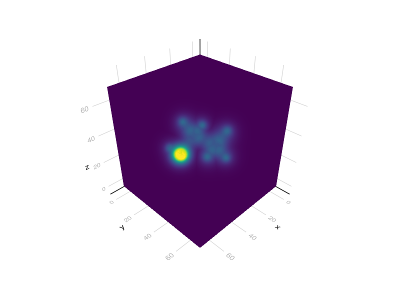

# DFT acceleration

```julia
"""
we compare electron density predicted by ML vs computed by DFT, noting reduction in SCF iterations by starting with an ML density vs SAD density
"""

using DFTK
using LinearAlgebra
using FileIO
using UnPack
using PeriodicTable
using DataStructures
using EquivariantOperators

# include("../src/NeuralDFT.jl")
# using .NeuralDFT
include("../src/pretrained.jl")
include("utils_DFTK.jl")

# we use an older version of DFTK because I'm unable to get the newest version to build correctly. Install in REPL: ]add DFTK@0.3.10

# whether to re-instantiate models or load them from cache file
reset = true
# reset=false

# atomic numbers 
Z = [6, 6, 8, 1, 1, 1, 1, 1, 1]

pos = 1.88973 * [
    -0.0086050396 1.5020382883 -0.0068121748;
    0.0109931006 -0.0176487687 -0.013770355;
    0.6808884095 -0.4404180314 -1.1931320987;
    1.0115333417 1.896620303 -0.0192015475;
    -0.5315986204 1.8807610923 -0.8897465868;
    -0.5167457158 1.876117708 0.8871073864;
    0.5237712083 -0.3891229547 0.8882408183;
    -1.0202754406 -0.4050726108 0.0169067033;
    0.6952957263 -1.4017956761 -1.2014849452;
]'

# slightly offset the positions so origin is near the molecule's center
center!(pos)

# a x a x a lattice
a = 12
lattice = a * I(3)

# offset the positions so origin is at (1, 1, 1) of lattice array with the molecule centered in lattice
pos .+= a / 2

##==========
# DFT calculation with SAD initial density

# DFT parameters, refer to DFTK.jl docs
Ecut = 40
kgrid = [1, 1, 1]
tol = 1e-2

atoms = DefaultOrderedDict(Vector)
for (a, x) in zip(Z, eachcol(pos))
    xr = lattice \ x
    push!(atoms[psp[a]], xr)
end
atoms = collect(atoms)

model = model_LDA(lattice, atoms)
basis = PlaneWaveBasis(model, Ecut; kgrid=kgrid)
ρ = ρ_SAD = guess_density(basis)
scfres = self_consistent_field(basis; ρ,
    tol)
# ρ_SAD=guess_density(basis)
forces = compute_forces_cart(scfres)
forces = hcat(vcat(forces...)...)

@unpack energies, ρ = scfres
ρ_DFT = ρ[:, :, :, 1]
ρ_SAD = ρ_SAD[:, :, :, 1]

s=volume(ρ_DFT)
# display(s)
save("etoh.png",s)

s=volume(ρ_SAD)
# display(s)
save("etohsad.png",s)
##==========================

##===============
# repeat DFT with ML predicted density

d = "."
if !reset #
    predictor = load("$d\\demo1_predictor.jld2", "predictor")
else
    resolution = 0.15
    cell = resolution * I(3)
    model = DEMO1
    predictor = DensityPredictor(cell, model)
    save("$d\\demo1_predictor.jld2", "predictor", predictor)
end

domain = lattice
sz = size(ρ_SAD)
origin = ones(3)
periodic = false

# density prediction result
ρ_ML = predictor(Z, pos, domain, sz; periodic, origin)
@show nae(ρ_ML, ρ_DFT)
@show nae(ρ_SAD, ρ_DFT)

s=volume(ρ_ML)
# display(s)
save("etohml.png",s)

# rerun DFT
# ρ = reshape(ρ_ML, sz..., 1)
# scfres = self_consistent_field(basis; ρ,
#     tol);
```

## Output



<!--  -->


```
n     Energy            Eₙ-Eₙ₋₁     ρout-ρin   α      Diag
---   ---------------   ---------   --------   ----   ----
  1   -261.2259656906         NaN   4.88e-01   0.80   13.0
  2   -267.3105476010   -6.08e+00   2.10e-01   0.80    3.0
  3   -266.8053137845    5.05e-01   1.48e-01   0.80    5.0
  4   -266.0474887135    7.58e-01   3.00e-02   0.80    3.0
  5   -266.7987616624   -7.51e-01   9.09e-03   0.80    3.0
  6   -266.6789659157    1.20e-01   1.79e-03   0.80    3.0
  7   -266.6922824556   -1.33e-02   9.89e-04   0.80    3.0
  8   -266.6816123533    1.07e-02   1.22e-04   0.80    3.0
  9   -266.6834088550   -1.80e-03   3.13e-05   0.80    4.0

nae(ρ_ML, ρ_DFT) = 0.03266530392327634
nae(ρ_SAD, ρ_DFT) = 0.2013599127594411
```


DFT with conventional superposition of atomic density (SAD) guess, taking 4 iterations to reach density deviation of a few percent. SAD errs around 20% while our ML prediction errs 3% corresponding to reduction of 4 SCFs here. DFTK.jl treats the initial guess as highly inaccurate and needs small modification to capitalize on the much more accurate initial density
