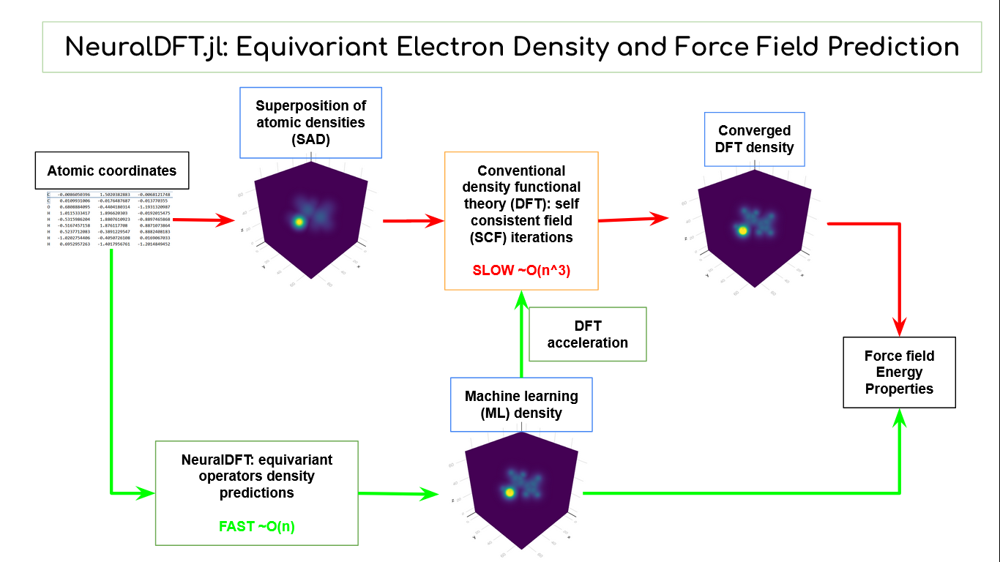

# Home

Star us on [Github](https://github.com/paulxshen/NeuralDFT.jl)

## Synopsis

NeuralDFT.jl implements in Julia an equivariant machine learning (ML) model for predicting the 3D electronic density distribution and atomic force fields of molecules and crystals. It can act as both an fast scalable ML surrogate for density functional theory (DFT) calculations in predicting properties or as a DFT accelerator by supplying a more accurate initial density for self-consistent field (SCF) iterations. The model's rotation and translation equivariance (covariance) assures symmetry preservation. 

## Electron density importance

Electron density is of central importance in quantum chemistry and materials science. It's a physical observable and the starting point in self consistent calculations in ab initio electronic structure computational methods like density functional theory (DFT) and Hartree-Fock (HF) for determining key properties like energy, forces, stability and band gap of chemicals and materials. 

<!---
 It's the
-->

## Machine learning for electron density

Machine learning for electron density can both accelerate ab initio methods and replace them in predicting properties. Electronic structure calculations suffer from superlinear scaling. DFT scales as O(n^3), making it computational taxing for medium sized systems and prohibitive for very large systems. ML on the other hand scales linearly as O(n). DFT iteratively refine the density so a good initial density predicted by machine learning can accelerate convergence and reduce computational cost. Alternately, many properties can be directly computed from electron density including forces via electrostatic integration and consequently relaxed geometry plus phonon states. One can also estimate the energy using empirical energy density functionals.

## Project status

Collaborators welcome for:
- DFT acceleration: work is mostly already done, just needs someone to write it up and finish benchmarking. See tutorial for DFTK.jl integration 
- Force fields for MD / structural relaxation: proof of concept see tutorial. can get accurate forces by electrostatic integration of density. needs demo on real problem
- Train density models on your system of choice eg electrolytes, catalysts... can do a few application specific papers
- Host as web API: relevant if you wanna do SWE/SDE in industry, wrap code in Julia container and push to AWS/GCP

## Contributors

Paul Shen pxshen@alumni.stanford.edu  

Former research staff with Professor Venkat Viswanathan venkvis@cmu.edu